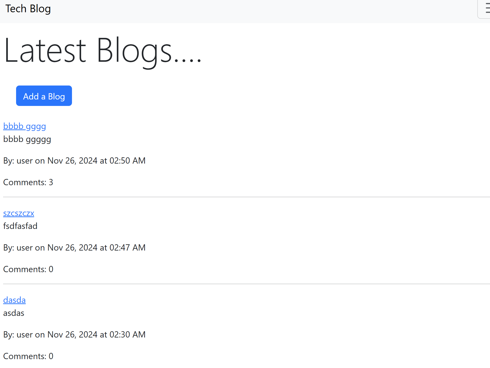
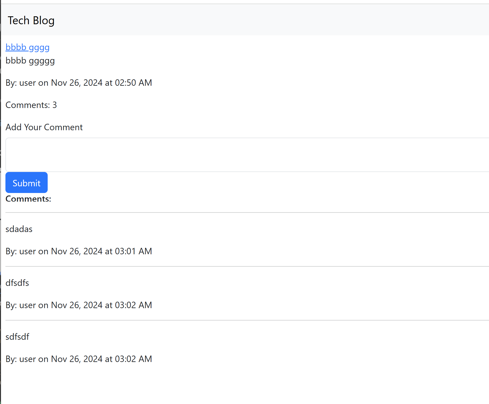
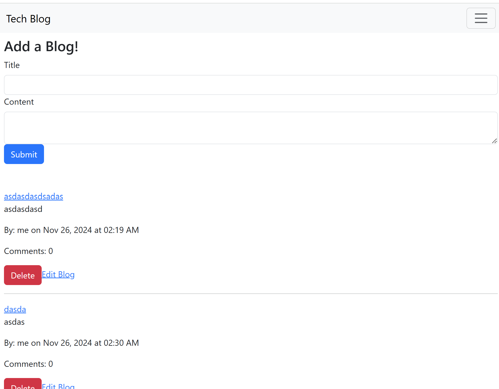
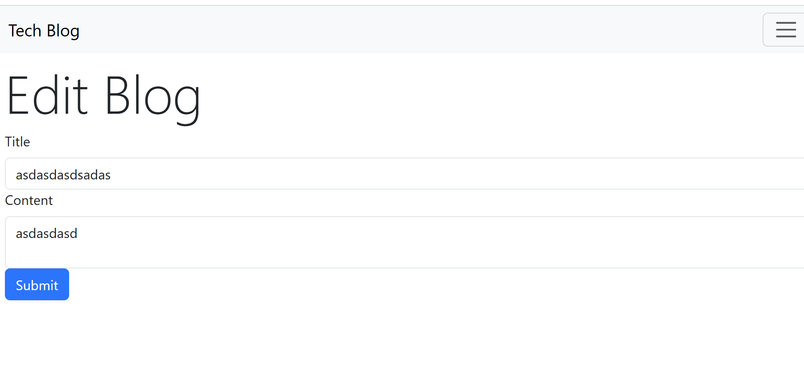

# Tech Blog Review App

      

## Description ✏️

A quick and simple blogging application built in TypeScript, React, and Apollo GQL with 1 level of comments. The focus here was not on CSS, so it's minimal. The app uses JWT authentication and Outlet context provided by react router dom to check loggedIn status when needed. An auth guard component protects the profile route. 

Currently using refetch functionality for updating the DOM but intend to switch to the Apollo cache. 


## Table of Contents 📖

[Installation](#installation)

[Usage](#usage)

[Issues](#known-issues)

[Contributing](#how-to-contribute)

[Tests](#tests)

[Credits](#credits)

[Questions](#questions)

## Installation

To install necessary dependencies, run the following command:

```
npm i
```

## Usage

Clone the repository, run the install command and then 'npm start:dev'. Then navigate to the localhost port (3000) with your browser. Introspection available at 3001/graphql.

### Deployed Link

[Click here to go to deployed project](https://apollo-mongo-blog.onrender.com)

### Screenshots






---

## Known Issues

- Deployed to render so the load time is prohibitively slow. Need to switch to headless architechture, deploy client on Netlify and leave server on Render and implement CORS. 
- Need pagination implementation
- Client code is not as componentized as it should be i.e. no Comment or CommentList

## How To Contribute

Fork the repository and make a pull request with your new code.

## Tests

To run tests, run the following command:

```
No tests
```

## Credits

Bootstrap and React Bootstrap for quick and simple styling.

## Questions

If you have any questions about the repo or notice any bugs you want to report, open an issue or contact me directly at megan.meyers.388@gmail.com.
